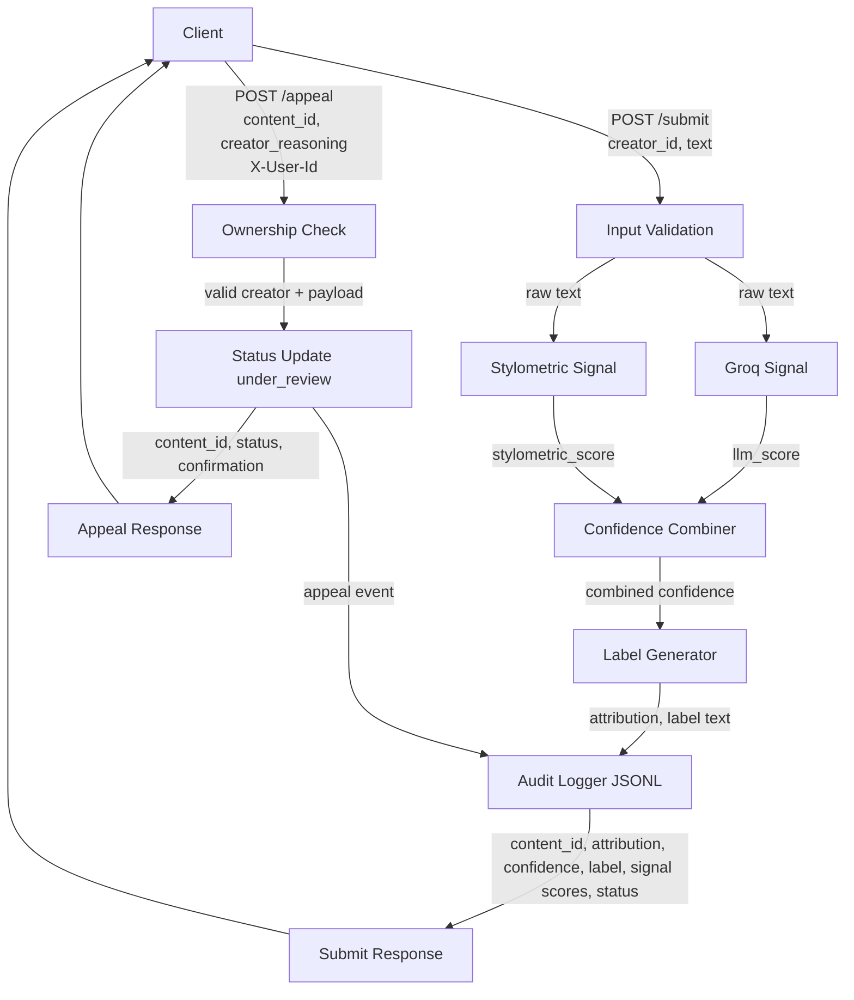

# Provenance Guard - planning.md

## 1) Project Goal
Build a backend service that classifies submitted text as likely AI-generated, likely human-written, or uncertain using multiple independent signals, then returns a transparent label, logs all decisions, and supports creator appeals.

Primary design principle: reduce harm from false positives (human text mislabeled as AI) by using an explicit uncertain range and neutral language.

## 2) Scope and Milestones
- M3: POST /submit, first signal integration, content IDs, basic audit logging, GET /log.
- M4: second signal integration, calibrated confidence scoring, full score logging.
- M5: label mapping, POST /appeal workflow, rate limiting, status lookup and health endpoints.

## 3) API Contract

### POST /submit
Request JSON:
- creator_id: string
- text: string (minimum 150 characters)

Optional request header:
- X-User-Id: string (mock auth identity)

Response JSON:
- content_id: string (UUID)
- attribution: "likely_ai" | "uncertain" | "likely_human"
- confidence: number (0.0-1.0)
- label: string
- signal_scores:
-   llm_score: number (0.0-1.0)
-   stylometric_score: number (0.0-1.0)
- status: "classified"
- created_at: ISO-8601 timestamp

### POST /appeal
Request JSON:
- content_id: string
- creator_reasoning: string (minimum 30 characters)

Required behavior:
- Validate content exists.
- Validate requester identity using X-User-Id.
- Only original creator can appeal in MVP.
- Update status to under_review.
- Append appeal event to audit log.

Response JSON:
- content_id: string
- status: "under_review"
- message: string

### GET /log
Response JSON:
- entries: array of latest audit events (structured)

### GET /content/<id>
Response JSON:
- content record including latest status, latest decision, and timestamps

### GET /health
Response JSON:
- status: "ok"
- service: "provenance-guard"
- timestamp: ISO-8601 timestamp

## 4) Detection Signals
At least two independent signals are used and then combined.

### Signal 1: LLM-Based Classification (Groq)
What it measures:
- Global semantic and stylistic coherence patterns associated with AI-generated writing.

Why chosen:
- Captures higher-level writing traits that simple numeric features miss.

Output format:
- llm_score in [0,1], where higher means more likely AI-generated.

Blind spots:
- Strongly edited AI text can look human.
- Highly formal human writing can look AI-like.
- Prompt wording can influence model sensitivity.

Normalization rule:
- Parse model output into a numeric score.
- Clip to [0,1].
- If parsing fails, fallback to 0.5 and mark fallback in logs.

### Signal 2: Stylometric Heuristics
Metrics used:
- Sentence length variance
- Type-token ratio (vocabulary diversity)
- Punctuation density

What it measures:
- Structural variability and lexical diversity often seen in human writing versus more uniform machine output.

Why chosen:
- Independent from semantic LLM judgment; computed locally and deterministically.

Output format:
- stylometric_score in [0,1], where higher means more likely AI-generated.

Blind spots:
- Short text can produce unstable heuristics.
- Poetry, lyrics, or intentional repetition can be flagged as AI-like.
- Non-native writing styles can affect type-token ratio.

Normalization rule:
- Convert each metric to an ai_likelihood subscore in [0,1] using explicit rule bands.
- Aggregate as weighted average of the three subscores.
- Clip final stylometric score to [0,1].

## 5) Confidence Scoring and Uncertainty Representation

### Combination rule
- combined_confidence = 0.50 * llm_score + 0.50 * stylometric_score
- Clip final value to [0,1].

### Label thresholds (balanced policy)
- likely_ai: confidence >= 0.75
- uncertain: 0.40 <= confidence < 0.75
- likely_human: confidence < 0.40

### Interpretation of a score around 0.6
- A 0.6 means signals indicate moderate AI-likeness but not enough agreement/strength for a high-confidence AI attribution. It should map to uncertain, not likely_ai.

### Calibration checks
- Run at least 4 fixed test inputs:
- one clearly AI-like sample
- one clearly human-like sample
- two borderline samples
- Verify score spread and threshold behavior rather than forcing all outputs to extremes.

## 6) Transparency Label Design (Exact Text)
The service returns one of three user-facing labels.

### High-confidence AI
"This content is likely AI-generated (high confidence). We may be wrong, but both language and writing-pattern signals strongly indicate AI assistance."

### Uncertain
"This content could not be confidently attributed. Signals are mixed, so this result is uncertain and should be interpreted with caution."

### High-confidence Human
"This content is likely human-written (high confidence). We may be wrong, but available signals do not strongly indicate AI generation."

Design notes:
- Plain language only.
- No model jargon.
- Explicit uncertainty language in every variant.

## 7) Appeals Workflow

### Who can appeal
- Original creator only (creator_id must match X-User-Id for MVP).

### Required appeal input
- content_id
- creator_reasoning (>= 30 chars)

### System behavior on appeal
- Validate identity and content ownership.
- Change content status from classified to under_review.
- Store appeal payload and timestamp.
- Append structured appeal event to audit log linked to original content_id.
- Return confirmation response.

### What a reviewer should see
- Original text (or stored submission record)
- Original attribution and confidence
- Both signal scores
- Original label text
- Creator appeal reasoning
- Current status and timeline entries

## 8) Rate Limiting Plan
Apply rate limits on POST /submit:
- 10 per minute per IP
- 100 per day per IP

Reasoning:
- Supports normal creator usage without friction.
- Reduces flood attempts and automated probing.
- Easy to demo by showing HTTP 429 responses after limit is exceeded.

## 9) Audit Logging Plan
Storage format:
- JSON Lines (one JSON object per event)

Each submission event includes:
- event_type: "classification"
- timestamp
- content_id
- creator_id
- attribution
- confidence
- llm_score
- stylometric_score
- label
- status
- normalization_notes (optional)

Each appeal event includes:
- event_type: "appeal"
- timestamp
- content_id
- creator_id
- appeal_reasoning
- status: "under_review"

Logging requirements:
- Append-only writes.
- Structured fields only (no unformatted print logs).
- Ensure at least 3 entries visible for demo, including at least one appeal.

## 10) Anticipated Edge Cases
1. Repetitive poetry or spoken-word style:
- Heavy repetition and simple vocabulary can look machine-like to stylometric features.

2. Formal academic human prose:
- Highly polished, consistent sentence structures can appear AI-like to both signals.

3. Short submissions near minimum length:
- Stylometric variance is less stable with limited text.

4. Lightly edited AI drafts:
- Human edits can reduce AI indicators, pushing scores into uncertain range.

## 11) Architecture

### Flow Narrative
Submission flow: incoming text is validated, scored by two independent detectors, merged into one confidence score, mapped to a plain-language label, written to audit log, and returned to the caller.

Appeal flow: creator submits appeal reasoning for a prior content_id, system verifies ownership, sets status to under_review, logs the appeal as a linked event, and returns confirmation.

### Mermaid Diagram

### ASCII Diagram

[Client] 
   |
   | POST /submit {creator_id, text}
   v
[Input Validation]
   |--(text, creator_id)--------------------------->
   |                                                |
   v                                                v
[Groq Signal]                                 [Stylometric Signal]
   | llm_score                                     | stylometric_score
   +---------------------> [Confidence Combiner] <+
                               | combined confidence
                               v
                         [Label Generator]
                               | attribution + label
                               v
                         [Audit Logger (JSONL)]
                               |
                               v
                        [API Response to Client]

[Client]
   |
   | POST /appeal {content_id, creator_reasoning}
   v
[Ownership Check via X-User-Id]
   |
   v
[Status Update: under_review]
   |
   v
[Audit Logger (appeal event)]
   |
   v
[Appeal Response]

## 12) AI Tool Plan

### M3: Submission endpoint + first signal
Spec sections to provide AI tool:
- Detection Signals (Signal 1)
- API Contract (POST /submit)
- Architecture diagram

Ask AI tool to generate:
- Flask app skeleton
- POST /submit route stub
- Groq scoring function with structured output parsing
- initial JSONL logging helper

Verification steps:
- Confirm response includes content_id, attribution, confidence placeholder, label placeholder.
- Unit-test Groq function separately with 2-3 samples.
- Confirm one classification event is appended to JSONL log.

### M4: Second signal + confidence scoring
Spec sections to provide AI tool:
- Detection Signals (both)
- Confidence Scoring and Uncertainty Representation
- Architecture diagram

Ask AI tool to generate:
- Stylometric feature extraction function
- normalization helpers
- score combiner and threshold mapper

Verification steps:
- Run 4 fixed test cases.
- Confirm meaningful score spread.
- Confirm category mapping matches threshold definitions exactly.
- Confirm log includes both signal scores and combined confidence.

### M5: Production layer
Spec sections to provide AI tool:
- Transparency Label Design
- Appeals Workflow
- Rate Limiting Plan
- Architecture diagram

Ask AI tool to generate:
- label generation function with exact text variants
- POST /appeal endpoint with ownership checks
- Flask-Limiter integration on POST /submit
- GET /content/<id> and GET /health endpoints

Verification steps:
- Force all three label variants with crafted inputs.
- Submit one valid appeal and verify status under_review.
- Trigger rate-limit 429 responses.
- Confirm audit log shows at least 3 structured entries with one appeal.

## 13) Stretch Feature Strategy
First stretch priority:
- Analytics dashboard

Rationale:
- Reuses existing structured logs.
- Minimal disruption to core classification pipeline.
- High demo value for patterns and appeal rates.

Update rule:
- This planning document must be updated before starting any stretch feature implementation.

### Stretch kickoff update (2026-06-27)
Selected stretch implementation now in progress:
- Analytics dashboard powered by existing JSONL audit events.

Planned dashboard outputs:
- Detection patterns: counts by attribution category (likely_ai, uncertain, likely_human).
- Appeal rates: appeals / classifications as a percentage.
- Additional metric: average confidence across classification events.

Implementation approach:
- Add GET /analytics endpoint that computes metrics from full audit_log.jsonl.
- Add GET /dashboard endpoint rendering a simple HTML view that fetches /analytics.
- Keep storage unchanged (no migration), reusing append-only JSONL as the source of truth.
